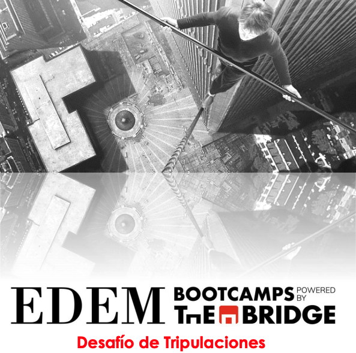
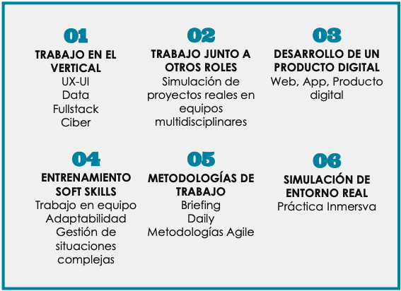
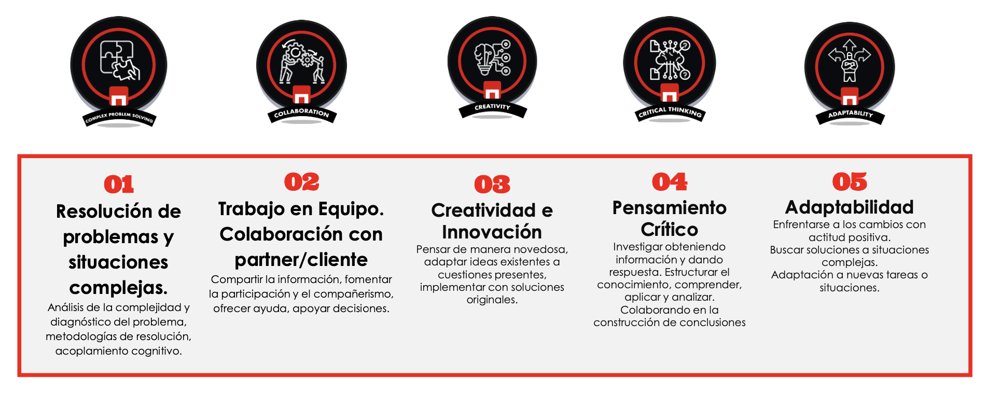

# BACKEND - Ejercicio

 <h1 align="center" style="color:red">Desafío de tripulaciones</h1>

  

    El <b>DESAFÍO DE TRIPULACIONES</b> <b style="color:red">es la práctica integrada</b>
en la que trabajan los <b style="color:red">estudiantes de todas las
disciplinas</b> a través de un proyecto real diseñado
conjuntamente con uno partner y desarrollado por los
estudiantes durante las últimas semanas de formación
en el Bootcamp.
Con esta práctica los <b>estudiantes se enfrentan al día a
día de su futuro profesional</b> trabajando de principio a
fin en un proyecto en el que se involucran como
miembros del departamento de una empresa o
simulando el emprendimiento de un proyecto propio.

   
    <a href="https://github.com/pafz/group2-back"><strong>Uso de node + express y mysql/sequelize</strong></a>
     
    ·
    <a href="https://github.com/pafz/group2-back/issues">Report a Backend Bug</a>
    ·
    <a href="https://github.com/yolovi/tripulaciones-front/issues">Request a Frontend Bug</a>
    

 <h1 align="center" style="color:red">Desafío - Cliente</h1>
 
El Desafío de Tripulaciones en el intake MAYO23 promoción EDEM Powered by The Bridge tiene como objeto el desarrollo de un
Producto digital
para la gestión y comunicación de eventos
Marina de Empresas

 <h1 align="center" style="color:red">Objetivos DT</h1>
 
El producto-aplicación digital deberá aglutinar toda la actividad de eventos que se lleva a cabo desde MdE.
La aplicación deberá atender a las necesidades presentes y futuras de MdE
Además, deberá dar respuesta a las siguientes cuestiones: ¿Cómo comunicar los eventos y organizarlos?
¿Cómo gestionar y registrar las inscripciones, asistencias y feedback? ¿Cómo motivar la participación?
La aplicación tendrá la capacidad de generar mecanismos de visibilidad y potenciar la participación en los eventos de MdE
Se valorará la implementación de métodos de fácil registro de asistencia, así como medios y herramientas que permitan llevar un control y proyección de eventos a organizar

 <h1 align="center" style="color:red"> Criterios de Valoración</h1>
 
1. Presentación&Defensa: Comunicación y Calidad
La calidad de la Exposición y La calidad de los soportes utilizados
2. Presentación&Defensa: Gestión del tiempo
Ser capaces de hacer entender a la audiencia y jurado la solución propuesta y el impacto en negocio y usuario en el tiempo de presentación establecido
3. Soft Skills 1: Trabajo en equipo. Adaptabilidad. Toma de decisiones
4. Soft Skills 2: Capacidad de Trabajo. Autonomía. Liderazgo
5.- Interacción del conocimiento. Competencias técnicas Control técnico de la disciplina y valor diferenciador.
 

 <h1 align="center" style="color:red">Contextualización</h1>
 

  <h1 align="center" style="color:red">Herramientas metodológicas</h1>
 

<!-- ABOUT THE OBJECTIVES -->
  <h1 align="center" style="color:red">
 Competencias específicas Full Stack</h1>

## Objetivos

<views>
          <ul>
            Compotencias
            <li>Crear la arquitectura de la solución, y encargarse de la implementación de la misma.</li>
            <li>Decidir las tecnologías a usar con sentido y trabajando de la mano con Ciberseguridad para llegar a un consenso de nivel de seguridad.</li>
            <li>Trabajar en un front y back que permita visualizar los datos de la app y permita la interacción del usuario de la mano de los compañeros de UX.</li>
            <li>Desarrollar el front de la app con React y backend con node + express.</li>
            <li>La aplicación debe ser mobile-first y SPA (single page application), de manera que no haya en ningún momento recarga de página, y solo se carguen y rendericen aquellos contenidos mínimos necesarios con cada cambio de endpoint.</li>
            <li>Documentación.</li>
            <li>Proactividad, originalidad y búsqueda de soluciones a todos los niveles.</li>
            <li>Elegir la bbdd (SQL o NoSQL) adecuada para cada app en función del modelo de datos necesitado compatible con el resultado del trabajo de Data.</li>
            <li>Se permite (y recomienda, si con ello se minimiza el tiempo de desarrollo y se acelera así el de entrega) el uso de cualquier recurso de terceros (librerías, paquetes npm, etc.) además del código propio.</li>
            <li>Gestionar el control de versiones con GitHub desde el principio del proyecto.</li>
            <li>Gestionar la documentación y pruebas del proyecto hasta el punto que el tiempo lo permita y de la mejor manera posible.</li>
            <li>Trabajar con los compañeros en la presentación, para exponer el trabajo de desarrollo.</li>
          </ul>

</views>

(<a href="README.md#top">volver al principio </a>)

<!-- FUTURE -->

## Future Roadmap

- [ ] <b>Métricas generales</b> 
Tener una vista general de todos los eventos con la opción de personalizar y filtrar las métricas.

- [ ] <b>Chat interno</b> 
Canal de comunicación interna entre departamentos.

- [ ] <b>Mejora de algoritmo</b> 
Algoritmo de recomendación 
según intereses y asistencia.

- [ ] <b>Espacios y salas</b> 
Gestión de disponibilidad de salas.

- [ ] <b>Notificaciones</b> 
Match de perfiles entre asistentes.

- [ ] <b>Networking</b> 
Match de perfiles entre asistentes.

- [ ] <b>Asistente virtual</b> 
Asistente virtual que brinda información antes del evento.

(<a href="README.md#top">volver al principio </a>)

<!-- LICENSE -->

## License

Este proyecto ha sido realizado como trabajo de aprendizaje por Adrían Pastor, Yolanda López, Juanda Mayorga y Patricia Fernández.

(<a href="README.md#top">volver al principio </a>)

<!-- PREVIEW -->

## Preview

- General overview

<!-- CONTACT -->

## Contact

Adrián Pastor

Yolanda López

  

Juanda Mayorga

Patricia Fernández

(<a href="README.md#top">volver al principio </a>)

